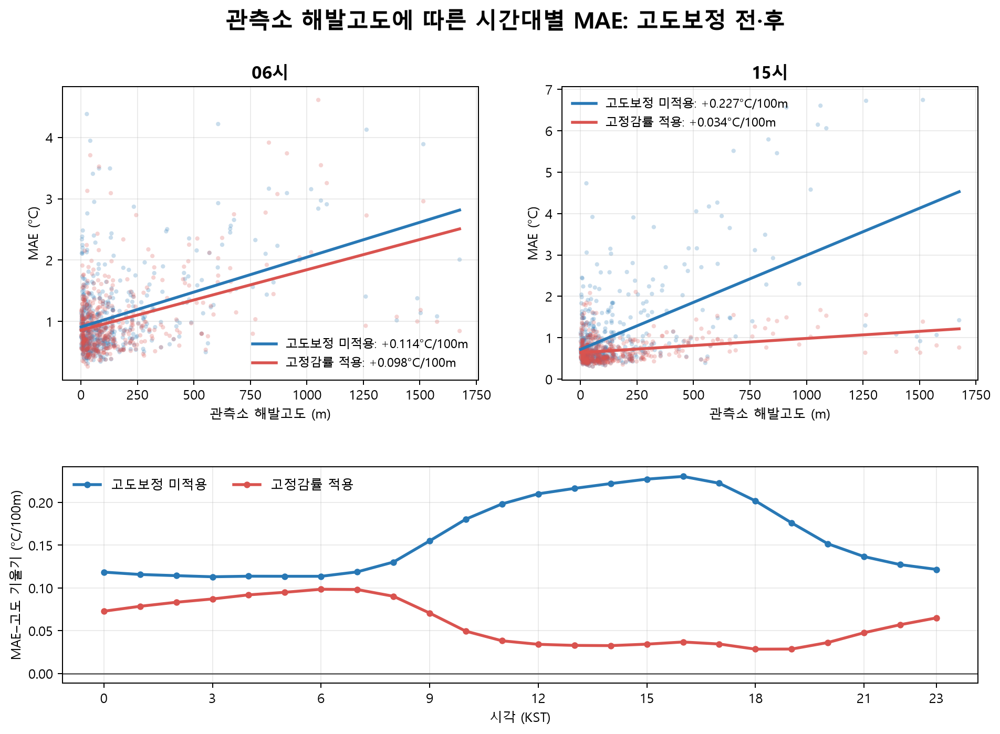

# 기상자료 분석

**연구자료 | KMA AWS 기온 보간과 고도보정 효과 분석**

주변 AWS 관측소의 기온으로 한 관측소의 기온을 추정하고, 관측소 사이의 고도차를 보정했을 때 오차가 얼마나 달라지는지 비교했습니다. 2024년 자료를 이용해 IDW 보간과 고정감률 보정을 구현하고, 전국 관측소 평가에서 시간대·고도별 오차 분석까지 확장했습니다.

전국 평가에서 고정감률 보정은 MAE를 약 **20.6%** 낮췄습니다. 다만 관측소와 시간대에 따라 효과가 달랐고, 전국 단위의 월별·고도구간별 감률은 초기 8개 지점 실험에서 고정감률보다 좋은 성능을 보이지 않았습니다.

## 구현한 내용

- **자료 수집·정리:** KMA API의 시간별 AWS 자료를 관측소·월별 CSV로 저장하고, 관측소 운영기간에 맞춰 데이터를 준비합니다.
- **기온 보간:** Haversine 거리 기반 IDW와 고도보정을 적용합니다. `none`, `fixed_lapse`, `monthly_lapse`, `band_lapse`를 비교할 수 있습니다.
- **전국 평가:** 평가 지점 자신을 이웃에서 제외하는 LOO 평가, 월별 병렬 처리, parquet 중간 저장, SQLite 집계를 구현했습니다.
- **결과 분석:** MAE·RMSE·BIAS, 시간대·계절·고도별 비교, 이웃 기하·지형과 오차의 연관성, BIAS 재표집 분석을 수행했습니다.
- **조회·시각화:** 저장 결과 조회, 이웃 선택·가중치·기온 시계열 그림, 지도·대시보드용 자료 생성을 지원합니다.

## 데이터와 실험 조건

| 항목 | 조건 |
|---|---|
| 자료 | 2024년 1–12월 KMA AWS 기온 `TA`, 1시간 간격, KST |
| 이웃 선택 | 반경 30km, 가까운 관측소 최대 10개, 최소 3개 |
| 가중치 | 거리 제곱의 역수 `1/d²` |
| 고정감률 | −0.0065°C/m, 즉 −6.5°C/km |
| 전국 평가 | 후보 549개 중 평가 가능 529개, 방법별 4,475,234개 관측 |
| 시간대·고도 분석 | 자료 충족 조건을 적용한 513개, 방법별 4,454,204개 관측 |

원자료·메타데이터·대용량 DB는 저장소에 포함하지 않습니다. 자료 준비와 표본 선정 조건은 [데이터 안내](docs/data.md)와 [방법 설명](docs/methods.md)에 정리했습니다.

## 실제 결과

전국 529개 관측소의 유효 관측을 모아 계산한 결과입니다. 관측소별 지표의 단순 평균과는 다릅니다.

| 방법 | MAE (°C) | RMSE (°C) | BIAS (°C) |
|---|---:|---:|---:|
| IDW, 고도보정 없음 | 1.07533 | 1.56331 | −0.06302 |
| IDW + 고정감률 | **0.85398** | **1.24326** | +0.03835 |

출처: 기존 전국 평가의 [집계 CSV](docs/results/fullnet_analysis_summary.csv). 오차는 `예측−관측`으로 정의했습니다.



513개 관측소 분석에서 15시 MAE–고도 회귀기울기는 **0.227→0.034°C/100m**로 낮아졌고, 06시는 **0.114→0.098°C/100m**로 변화가 작았습니다. 이 수치는 고도에 따른 평균적 오차 경향이며, 모든 관측소가 같은 폭으로 개선됐다는 뜻은 아닙니다. [세부 결과와 기존 실험 비교](docs/results.md)

## 결과에서 배운 점

- 전체 평균의 개선만으로 각 지점의 보정 효과를 설명할 수 없었습니다. 시간대와 이웃 관측소의 고도차를 함께 봐야 했습니다.
- MAE와 BIAS는 다른 정보를 줍니다. 오차 크기가 줄어도 과대추정이 과소추정으로 바뀔 수 있어 두 지표를 구분했습니다.
- 더 세분화한 감률이 항상 더 좋은 결과를 주지는 않았습니다. 이번 실험에서는 고정감률을 비교의 기준으로 유지했습니다.

## 실행

Python **3.12**에서 검증했습니다. 프로젝트 루트에서 실행합니다.

```bash
python -m venv .venv
# Windows PowerShell: .\.venv\Scripts\Activate.ps1
# macOS/Linux: source .venv/bin/activate
python -m pip install -r requirements.txt
python test_idw_lapse_methods.py
python test_stage0_invariants.py
```

위 테스트는 AWS 원자료 없이 실행할 수 있습니다. [데이터 안내](docs/data.md)에 따라 자료를 준비한 뒤 단일 관측소를 평가합니다.

```bash
python run_test.py
# 입력 예: 2024-02-01 / 2024-02-01 / 116
```

고도보정 비교는 `run_elevation_compare.py`, 초기 다지점 파이프라인은 `run_pipeline.py`, 전체망 생산은 `stage1_produce.py`를 사용합니다. 각 실행의 입력·출력, 선택 의존성, API 키 설정, 테스트 명령은 [실행 안내](docs/running.md)를 참고하세요.

## 폴더 구조

```text
├── kma.py / find_stations.py / load_aws.py    # 수집·메타데이터·자료 준비
├── idw.py / fast_idw.py / elevation_correction.py / lapse_rate.py
├── pipeline_config.py / project_paths.py    # 실험 설정·자료 경로
├── run_*.py / stage*.py / new_*.py           # 실행·전국 평가·조회
├── analyze_*.py / bias_*.py / visualize_*.py # 분석·시각화
├── test_*.py / validate_*.py                 # 기존 검증과 보안 검사
├── docs/                                   # 방법·실행·결과 설명
│   ├── assets/                             # 기존 결과 그림
│   └── results/                            # 선별한 소형 집계표
└── requirements*.txt
```

## 한계

평가는 2024년 AWS 관측소 위치의 기온을 대상으로 했습니다. 다른 연도·변수·임의 위치에서의 성능을 입증한 결과는 아닙니다. 이웃이 부족한 20개 후보는 전국 성능 집계에서 제외됐습니다. 지형·시간대와 오차의 연관성은 실제 대기 역전이나 원인에 대한 직접 증명이 아닙니다.

eLoran 시간적 ASF 보정 모델용 기상 입력자료가 활용 목적이지만, 이 저장소의 구현 범위는 기온 보간과 평가입니다. ASF 딥러닝 모델 학습이나 ASF 정확도 개선은 이 결과에 포함하지 않았습니다.
