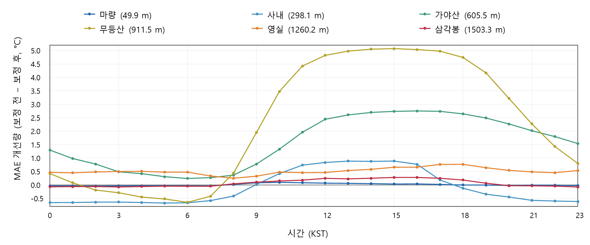

# 실험 결과

## 전국 LOO 평가

2024년 1–12월, 후보 549개 중 보간 가능한 529개 관측소를 평가했다. 반경 30km, 이웃 3–10개, 거리 지수 2를 사용했다. 아래 값은 방법별 4,475,234개 유효 관측의 pooled 지표다.

| 방법 | MAE (°C) | RMSE (°C) | BIAS (°C) |
|---|---:|---:|---:|
| `none` | 1.07533 | 1.56331 | −0.06302 |
| `fixed_lapse` | 0.85398 | 1.24326 | +0.03835 |

MAE 감소율은 약 20.6%이다. 전국 BIAS가 0에 가까워도 서로 다른 관측소의 양·음 오차가 상쇄될 수 있으므로 MAE와 함께 해석한다. 출처: [전국 집계표](results/fullnet_analysis_summary.csv), 생산 스크립트 `new_aggregate.py`.

## 시간대와 해발고도

주 분석 표본 513개 관측소를 각 시간대에서 동일한 관측소 단위로 비교했다. 아래는 MAE–고도 회귀기울기다. 단위는 °C/100m이며, 전국 평균 MAE와 다른 통계량이다.

| 시각 (KST) | 보정 전 | 고정감률 적용 후 |
|---|---:|---:|
| 06시 | +0.11366 | +0.09848 |
| 15시 | +0.22731 | +0.03430 |

오후에는 고도에 따른 MAE 증가 경향이 크게 완만해졌다. 06시는 변화가 작았다. 회귀의 설명력이 제한적이고 개별 관측소 차이가 있으므로 절대고도의 인과효과나 모든 지점의 개선으로 해석하지 않는다. 출처: [시간별 회귀 결과](results/continuous_elevation_hourly_relations.csv), `analyze_elevation_continuous_metrics.py`.

500m 이상 집단(40개)의 06시 MAE 중앙값은 2.056→1.644°C, BIAS 중앙값은 +1.175→−0.717°C였다. 오차 크기와 과대·과소추정 방향이 다르게 변하는 사례다. 이는 각 방법의 집단 중앙값이며 관측소별 짝 차이의 중앙값이 아니다. 출처: [고도집단별 시간 지표](results/standard_metrics_hourly_by_elevation.csv).

## 서로 다른 고도의 여섯 관측소

고도 50·300·600·900·1200·1500m에 가까운 실제 관측소를 주 표본에서 선택한 사례 그림이다. 지점 선정에는 오차값을 사용하지 않았다. 양수는 `보정 전 MAE−보정 후 MAE`가 양수, 즉 개선임을 뜻한다.

여섯 사례 모두 15시 개선량이 06시보다 컸지만, 더 높은 관측소일수록 개선량이 커지는 순서는 아니었다. 따라서 사례 그림을 고도별 전체 성능의 대표 추정치로 사용하지 않는다. [선정 지점](results/altitude_span_selected_stations.csv) · [시간별 값](results/altitude_span_station_hour.csv) · [요약](results/altitude_span_station_summary.csv)

## 초기 8개 지점의 감률 비교

전국망 확장 전 8개 관측소, 2024년 12개월, 방법별 67,979개 관측을 사용한 별도 실험이다. 전체망 결과와 표본이 다르다.

| 방법 | MAE (°C) | RMSE (°C) |
|---|---:|---:|
| `none` | 1.3750 | 1.8407 |
| `fixed_lapse` | 0.7993 | 1.0938 |
| `monthly_lapse` | 0.8201 | 1.1128 |
| `band_lapse` | 0.8242 | 1.1256 |

전국 자료로 추정한 월별·고도구간별 감률은 이 평가에서 고정감률보다 오차가 컸다. 이러한 결과를 지역별·시간별 감률의 일반적인 우열로 확대하지 않는다. 출처: [초기 감률 비교 CSV](results/variable_lapse_overall_scores.csv), `analyze_variable_lapse.py`.

## 해석할 때의 한계

2024년 한 해와 관측소 위치의 기온에 대한 평가다. 20개 고립 후보의 보간 불가 결과는 성능 집계에서 제외돼 있다. 시간대·지형·이웃 고도차와 오차의 연관성은 실제 대기 역전이나 인과관계를 직접 확인한 결과가 아니다. eLoran ASF 예측 정확도는 이 실험에서 평가하지 않았다.

원자료와 내부 보고서는 포함하지 않았으며, 공개한 그림·표의 원본 상대경로와 해시는 [출처 목록](results/provenance.json)에서 확인할 수 있다.
